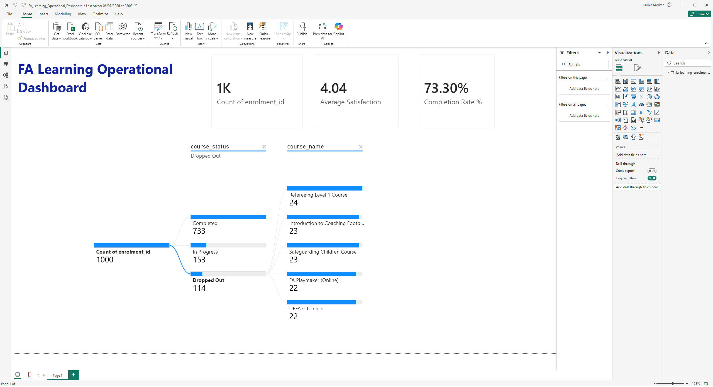

# ⚽ FA Learning: West Midlands Course Enrolment & Drop-Off Audit (Power BI)


*(Above: The completed FA Learning Operational Dashboard, showing course enrolments, completion rates, and regional candidate drop-offs.)*

## 🎯 Project Overview
As a West Midlands-based certified Data Analyst, I wanted to investigate how public-sector learning pathways can be optimised to improve course completion rates and support regional development. I used Python to programmatically generate a realistic, 1,000-row dataset representing raw course enrolment logs from FA Learning.

*   **The Problem:** Traditional learning departments often track course registrations but struggle to identify exactly where and why candidates drop out of their qualification pathways.
*   **The Solution:** I built an interactive Power BI dashboard to clean, process, and visualise student progress. Using a Decomposition Tree visual, I enabled users to drill down into specific courses and local authorities to identify attrition bottlenecks in under three seconds.

## 📊 Key Operational Insights
*   **Identifying Attrition Bottlenecks:** The interactive Decomposition Tree allows managers to select specific courses (e.g., "Refereeing Level 1") and trace drop-out rates down to the exact local authority (such as Sandwell or Dudley) to guide support allocation.
*   **Operational Reporting:** Measures the overall Course Completion Rate and Average Satisfaction scores, allowing the business to monitor the performance of learning programmes objectively.

## 🏆 Skills Demonstrated
*   **Data Generation:** Programmed a standard Python script to model a clean, relational CSV dataset.
*   **Data Cleaning (ETL):** Utilised Power Query to standardise date fields, handle empty values, and prepare the dataset for analysis.
*   **Power BI & DAX:** Applied standard variables and division functions (`DIVIDE`) to calculate key performance indicators.
*   **User-Centred Design:** Designed a simple, visual, and intuitive dashboard specifically to support self-service reporting.

## 📈 Simple DAX Code Example
```dax
Completion Rate % = 
VAR TotalEnrolments = COUNTROWS(fa_learning_enrolments)
VAR CompletedEnrolments = CALCULATE(
    COUNTROWS(fa_learning_enrolments), 
    fa_learning_enrolments[course_status] = "Completed"
)
RETURN
DIVIDE(CompletedEnrolments, TotalEnrolments, 0)
